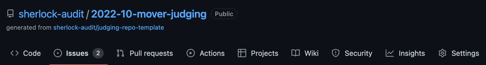

# Watson Points Example

First, you can find the Sherlock leaderboard [here](https://app.sherlock.xyz/audits/leaderboard).&#x20;

How are those leaderboard points calculated? And how you can move up the leaderboard as a security expert?

### **Where do leaderboard points come from?**

For the first \~6 months of Sherlock, Leaderboard Points were calculated based on each Watson's Code Arena ranking. Now that the bootstrapping phase is over, the only "new" Leaderboard Points (which come from Contest Points) are created from a small amount of inflation in each contest. Currently, there is 2% inflation on the Contest Points available in each contest. And each Watson brings their Leaderboard Points into each contest, and the sum of every Watson's Leaderboard Points make up the amount of Contest Points available in that contest (+2% inflation).&#x20;

In this example, there are 5 Watsons. Each one has competed in a 7-day contest previously, so each one has some Leaderboard Points:

<figure><figcaption></figcaption></figure>

Next, Alice, Bob, Carol, Dan, and Emily compete in their second Sherlock contest. It's a 14-day contest and at the end of the contest, there are 5 legitimate findings. One of them is High severity and four of them are Medium severity. The "1"s represent whether the participant submitted a particular finding or not. As we can see, Alice submitted the M1, M2, M3, and M4 findings. Bob only submitted the M2 finding. H1 represents the first High severity finding and M1 represents the first Medium severity finding.&#x20;

<figure><figcaption></figcaption></figure>

Here are the "sybil-resistant" formulas used to calculate how many "issue points" each participant gets for each finding:

> _Medium Risk Issue Points Weighting = 1 \* (0.9 ^ (IssueSubmissions - 1)) / IssueSubmissions_

> _High Risk Issue Points Weighting = 5 \* (0.9 ^ (IssueSubmissions - 1)) / IssueSubmissions_

As you can see, High severity issues are initially worth 5x more than Medium ones. But the final "issue points" awarded to each person depend heavily on how many others found the same issue. \
\
Here's how that same table from above looks using the "issue points" formulas:

<figure><figcaption></figcaption></figure>

As you can see, Carol and Emily were the only Watsons to find H1 (a High severity issue) and they were awarded the most points out of anyone because of it. M2 was significantly less fruitful because it is Medium severity and everyone found it.&#x20;

Based on these "issue points," we can now see who performed best in the contest and earned the most from the USDC pot:

<figure><figcaption></figcaption></figure>

Carol and Emily each make over 30% of the contest pot (over 60k USDC), largely driven by their submissions of H1, which no other Watsons found. Dan fared the worst because he only found 2 Medium severity issues, and other participants also found both of those Medium severity issues.&#x20;

Now comes a bit of complexity. The 5 participants have each completed a 7-day contest (previously) and a 14-day contest. Sherlock's scoring system puts a greater weight on the 14-day contest (2x weight to be exact) because it was a longer contest with a presumably larger codebase. So we'll take the old leaderboard points of all 5 participants (based on the 7-day contest) and weigh them against the new performances in the 14-day contest. As a reminder, points gained in the 14-day contest are relative to the % of the pot captured. Emily captured the highest % of the pot in the 14-day contest at \~34%, so she could see the biggest benefit from the second contest. However, the first contest will still make up \~1/3rd (7 days out of 21 days total) of her score.&#x20;

<figure><figcaption></figcaption></figure>

The formula being used to calculate Emily's score is the following:

> (50.0 \* (7 / 21)) + ((33.7% \* 714) \* (14 / 21))

The 714 represents the cumulative amount of leaderboard points in the second contest from all the competitors, adding 2% inflation (14 extra points). This is a simplified example where only the same 5 competitors happened to compete in similar-length contests.&#x20;

This is how the Sherlock leaderboard would look after these two contests:

<figure><figcaption></figcaption></figure>

Because of the increased weighting of the 14-day contest vs. the 7-day contest, Carol and Emily ended up higher on the leaderboard than Bob, despite Bob's high ranking after the 7-day contest.&#x20;
